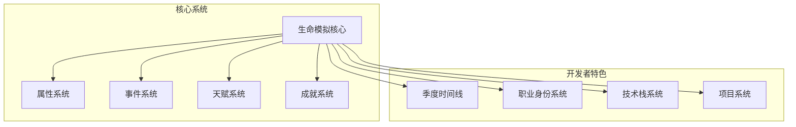
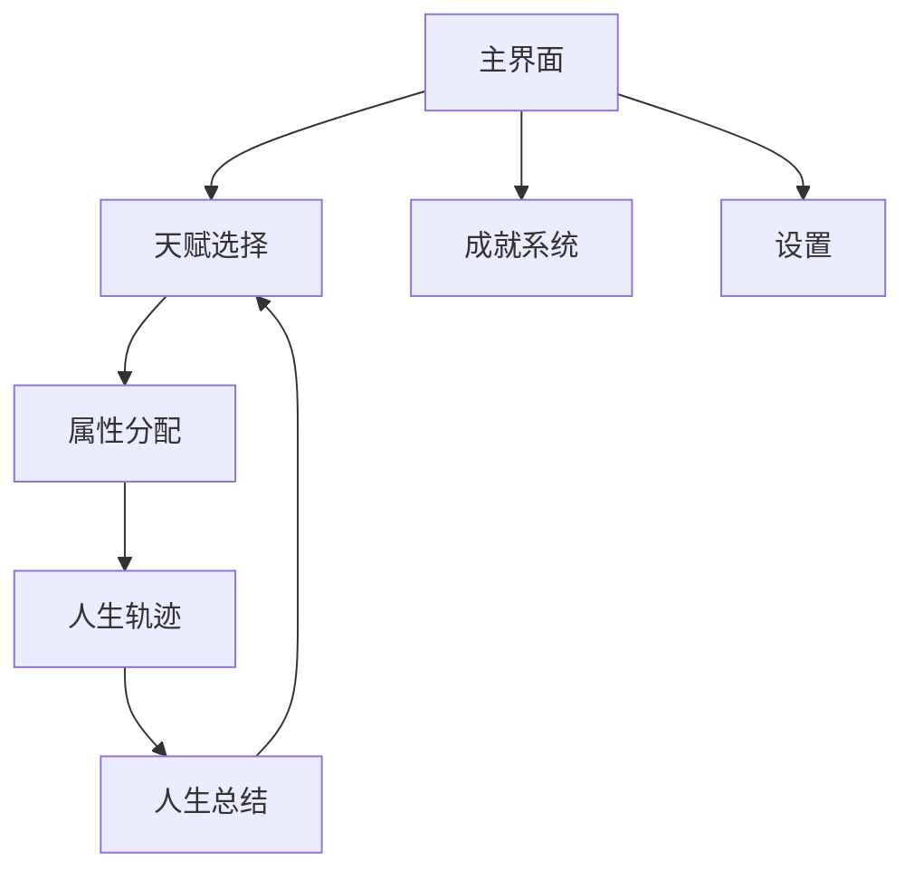

我现在要模仿人生重开模拟器（life restart）做一款应用开发相关的小游戏，标题为开发者重开模拟器(Developer Life Restart)，大概内容如下，请你为我完善策划案和实现方案：

1. 时间线
   1. 从大学入学开始，每一次条目是一个季度
   2. 如何终止游戏
      1. 破产
      2. 因为各种原因死亡
      3. 能设置什么大概率终止的条件吗
2. 身份
   1. 独立开发者的历程
   2. 创业团队的历程
   3. 在大厂
   4. 身份可能会在中途变换
   5. 职业规划上主要专注于产品开发领域，先后经过产品、开发、运营、商业化等全生命周期
3. 内容
   1. 加入一些时下热门的元素
   2. 还能加入一些AI的元素
4. 修改
   1. 属性
      1. 颜值->名声
      2. 智力->能力
      3. 体质->健康
      4. 家境->资金
      5. 快乐->心态
   2. 事件
      1. 根据这个调性重新生成
      2. 参考原来数据的风格
   3. 成就
      1. 根据这个调性重新生成
      2. 参考原来数据的风格
   4. 天赋
      1. 根据这个调性重新生成
      2. 参考原来数据的风格
   5. 年龄
      1. 相应修改


(Deep)

# 开发者重开模拟器 (Developer Life Restart) 策划案 

## 一、游戏概述

开发者重开模拟器是基于原版"人生重开模拟器"的核心机制，但将主题转换为软件开发者的职业生涯模拟。玩家将从大学入学开始，经历软件开发者的各种职业阶段和挑战，体验产品开发的全生命周期。

## 二、详细设计

### 1. 时间线设计

#### 1.1 基本时间流程
- 游戏从大学入学（约18岁）开始，每个条目代表一个季度（3个月） `life.js:134-145`

#### 1.2 游戏终止条件
- **破产**：资金属性降至0以下
- **猝死**：健康属性降至0（加班过度、压力太大）
- **职业倦怠**：心态属性降至极低值且持续数个回合
- **自然退休**：年龄达到65岁以上可选择退休结算 `property.js:353-354`

#### 1.3 高概率终止条件
- 连续多个季度项目失败导致资金耗尽
- 健康状态持续恶化（加班文化、高压环境）
- 创业失败且负债累累 `event.js:45-53`

### 2. 身份系统

#### 2.1 可选身份路径
- **独立开发者**：自由但风险高，资源少，决策权大
- **创业团队**：需平衡团队管理与产品开发，资金压力大
- **大厂员工**：稳定性高，晋升路径清晰，但自主性较低 `character.js:87-91`

#### 2.2 职业发展系统
- 身份可在游戏过程中转换（如：大厂员工跳槽创业）
- 职业规划覆盖产品全生命周期：开发→产品→运营→商业化 `life.js:109-123`

### 3. 游戏内容与元素

#### 3.1 时下热门元素
- **技术栈选择**：前端/后端/全栈/AI/区块链等
- **创投环境**：融资轮次、风投热点、经济周期
- **开发趋势**：敏捷开发、DevOps、微服务架构等 `zh-cn.js:24-28`

#### 3.2 AI相关元素
- **AI开发工具**：提升开发效率但可能带来技术依赖
- **AI产品集成**：产品中加入AI功能，增加产品竞争力
- **AI伦理事件**：处理AI应用中的伦理问题与责任 `talent.js:138-150`

## 三、属性与系统修改

### 1. 属性系统调整
- **名声** (CHR)：行业影响力、技术社区声誉
- **能力** (INT)：技术能力、学习能力、解决问题能力
- **健康** (STR)：身体状况、抗压能力、工作生活平衡
- **资金** (MNY)：个人储蓄、投资资本、项目预算
- **心态** (SPR)：工作热情、心理健康、职业满足感 `property.js:6-60`

### 2. 事件系统设计
根据开发者主题重新设计事件：
- **技术事件**：学习新技术栈、解决技术难题、技术选型
- **职场事件**：加班、晋升、裁员、跳槽、团队冲突
- **项目事件**：立项、开发、测试、发布、维护
- **创业事件**：寻找联合创始人、融资、扩张、倒闭 `event.js:9-20`

### 3. 成就系统
- **技术成就**：掌握多种编程语言、完成开源贡献
- **产品成就**：产品达到百万用户、获得行业奖项
- **职业成就**：成为CTO、创立独角兽公司
- **生活成就**：在高压工作中保持工作生活平衡 `achievement.js:6-12`

### 4. 天赋系统
- **技术天赋**：编程天才、算法专家、设计达人
- **软技能天赋**：沟通高手、团队领袖、谈判专家
- **思维天赋**：创新思维、逻辑思维、批判性思维
- **职场天赋**：人脉广泛、抗压能力强、职场政治嗅觉敏锐 `talent.js:12-30`

## 四、实现方案

### 1. 技术架构
沿用原版游戏架构，保持核心模块结构：
- Life模块：控制游戏主流程
- Property模块：管理属性系统
- Event模块：处理事件系统
- Talent模块：管理天赋系统
- Achievement模块：管理成就系统 `life.js:10-17`

### 2. 数据结构
- 按季度而非年龄存储事件，更新事件触发机制
- 增加职业路径相关的状态追踪
- 扩展原有属性系统以适应开发者主题 `property.js:45-63`

### 3. 用户界面
- 保留卡片式UI设计，但更新为科技/开发风格
- 增加职业生涯路径可视化
- 添加技术栈和项目组合展示区域 `app.js:83-93`

## 拓展特色

1. **项目管理系统**：玩家需要在游戏中管理自己的项目，处理进度、质量和成本之间的平衡
2. **技能树系统**：模拟开发者学习路径，不同技术栈有不同发展方向
3. **社交网络**：建立开发者社交关系，影响求职、创业和项目合作
4. **市场反馈机制**：项目发布后有用户反馈和市场表现，影响后续发展

## Notes

1. 这个方案保留了原版人生重开模拟器的核心机制，同时根据开发者主题进行了深度定制。
2. 游戏进度按季度而非年龄计算，使得职业发展更加细致。
3. 核心属性体系与原版基本一致，但含义有所调整，更符合开发者职业特点。
4. 事件系统将完全重写，聚焦于软件开发生命周期和职业发展。
5. 游戏终止条件更加多样化，反映了开发行业的现实挑战。


# 开发者重开模拟器(Developer Life Restart)策划案

基于对Life Restart游戏的分析，我为您设计了一个开发者主题的生命重开模拟器。这个游戏将模拟开发者从大学到职业生涯的发展历程，包含多种职业路径和事件系统。

## 系统架构

游戏将沿用Life Restart的核心架构，但针对开发者主题进行定制：



## 游戏流程

1. **天赋选择**：选择3个开发者相关天赋
2. **属性分配**：分配初始属性点
3. **人生轨迹**：按季度推进，触发事件
4. **总结评价**：根据成就和属性给出评价

## 详细设计

### 1. 时间线设计

- **起点**：大学入学（18岁）
- **时间单位**：每个季度（3个月）为一个单位
- **终止条件**：
  - 破产（资金为负且连续3个季度无收入）
  - 健康值降至0（过劳死、意外事故等）
  - 心态崩溃（心态值降至0，抑郁或职业倦怠）
  - 技术淘汰（能力值低于行业平均且连续5个季度未更新技能）
  - 自然老龄（65岁退休） `app.js:689-693`

### 2. 身份系统

玩家可以体验不同的职业路径，且可以在游戏中转换：

1. **独立开发者**
   - 特点：自由度高，风险大，收入不稳定
   - 专属事件：独立开发项目、参加黑客马拉松、发布个人作品

2. **创业团队**
   - 特点：团队协作，融资压力，高风险高回报
   - 专属事件：寻找联合创始人、融资路演、团队扩张

3. **大厂工程师**
   - 特点：稳定收入，晋升体系，技术专精
   - 专属事件：晋升评审、大型项目、技术分享

4. **职业发展阶段**
   - 产品：需求分析、用户研究、产品规划
   - 开发：编码实现、架构设计、技术选型
   - 运营：用户增长、数据分析、社区运营
   - 商业化：商业模式、营销策略、盈利增长 `app.js:642-666`

### 3. 属性系统

修改原有属性以适应开发者主题：

| 原属性 | 新属性 | 描述 |
|-------|-------|------|
| 颜值 | 名声 | 影响人脉资源、项目曝光度 |
| 智力 | 能力 | 技术水平、解决问题能力 |
| 体质 | 健康 | 工作强度承受力、抗压能力 |
| 家境 | 资金 | 可投入项目的资金、生存时间 |
| 快乐 | 心态 | 面对挫折的态度、工作热情 | 

### 4. 天赋系统

开发者相关天赋示例：

**一级天赋（常见）**
- 自学能力：学习新技术速度+20%
- 熬夜达人：健康消耗-15%
- 社交达人：名声获取+20%

**二级天赋（稀有）**
- 算法天才：解决技术难题几率+30%
- 产品直觉：产品决策正确率+25%
- 投资眼光：项目收益+20%

**三级天赋（极稀有）**
- 全栈大师：所有技术领域能力+15%
- 商业奇才：商业模式创新几率+40%
- AI先驱：AI相关项目成功率+50% `app.js:534-539`

### 5. 事件系统

事件类型：
- 学习事件：技术学习、课程培训
- 项目事件：项目开发、产品发布
- 职场事件：晋升、跳槽、创业
- 技术事件：技术选型、架构设计
- 商业事件：融资、盈利模式
- 随机事件：行业变革、技术革新

热门元素融入：
- Web3/区块链项目
- AI应用开发
- 低代码平台
- 云原生技术
- 元宇宙项目 `app.js:688-703`

### 6. 成就系统

成就示例：
- **技术类**：全栈工程师、AI专家、架构师
- **项目类**：百万用户、App Store推荐、开源贡献者
- **商业类**：首次盈利、成功融资、企业上市
- **职业类**：大厂Offer、技术总监、CTO `app.js:249-254`

## 实现方案

### 数据结构设计

1. **属性数据**：
```json
{
  "FAM": { "name": "名声", "description": "影响人脉资源和项目曝光度" },
  "ABL": { "name": "能力", "description": "技术水平和解决问题能力" },
  "HLT": { "name": "健康", "description": "工作强度承受力和抗压能力" },
  "MNY": { "name": "资金", "description": "可投入项目的资金和生存时间" },
  "MND": { "name": "心态", "description": "面对挫折的态度和工作热情" }
}
```

2. **事件数据**：
```json
{
  "id": "10001",
  "event": "参加黑客马拉松",
  "grade": 2,
  "description": "你参加了一场48小时的黑客马拉松",
  "postEvent": "你的团队获得了最佳创新奖",
  "effect": {
    "ABL": 1,
    "FAM": 2,
    "HLT": -1,
    "MND": 1
  },
  "branch": [
    {
      "condition": { "ABL": 7 },
      "description": "凭借出色的技术实力，你的项目获得了投资人关注",
      "effect": { "MNY": 3, "FAM": 3 }
    }
  ]
}
```

3. **天赋数据**：
```json
{
  "id": "1001",
  "name": "算法天才",
  "description": "你在算法领域有着非凡的天赋",
  "grade": 2,
  "effect": {
    "ABL": 2,
    "trigger": [
      {
        "type": "EVENT",
        "condition": { "event": "技术难题" },
        "effect": { "ABL": 1, "FAM": 1 }
      }
    ]
  }
}
```

### 技术实现

1. **前端实现**：
   - 使用Vue/React构建界面
   - 响应式设计适配移动端和PC端
   - 动画效果增强用户体验

2. **后端实现**：
   - 使用Node.js构建服务
   - 数据存储使用JSON文件或轻量级数据库
   - 可选云存储用户进度

3. **核心算法**：
   - 事件触发机制：基于当前属性、身份和随机因素
   - 属性变化系统：事件影响属性，属性影响事件触发概率
   - 职业路径转换：基于关键决策点和属性阈值 `index.js:53-62`

## 游戏界面设计



1. **主界面**：游戏标题、开始按钮、成就系统、设置
2. **天赋选择**：可选天赋列表、已选天赋、随机选择
3. **属性分配**：五项属性调整、剩余点数、确认按钮
4. **人生轨迹**：当前季度、事件描述、属性变化、选择分支
5. **人生总结**：生涯回顾、属性最终值、获得成就、重开选项 `CyberMain.ui:481-540`

## 扩展功能

1. **技术栈系统**：选择专精技术方向（前端、后端、移动端等）
2. **项目系统**：开发不同类型项目，积累作品集
3. **人脉系统**：建立行业人脉，获取资源和机会
4. **市场系统**：模拟技术市场变化，影响职业选择
5. **多结局系统**：根据最终成就和属性给出不同评价

## 游戏平衡性

1. **难度曲线**：初期较为简单，随着游戏进程逐渐增加挑战
2. **多样性**：确保不同路径都有独特体验和成就
3. **随机性**：保持一定随机性，增加可玩性和重玩价值
4. **平衡性**：各职业路径难度和收益平衡

## 实施计划

1. **阶段一**：核心系统开发（属性、事件、天赋）
2. **阶段二**：内容创作（事件库、天赋库、成就系统）
3. **阶段三**：UI设计和实现
4. **阶段四**：测试和平衡性调整
5. **阶段五**：发布和后续更新

Notes:
本策划案基于Life Restart游戏的核心机制，但针对开发者主题进行了全面改造。主要修改包括时间单位从年改为季度、属性系统重新定义、事件和天赋内容针对开发者场景重新设计，以及增加了职业身份系统。实现方案保留了原游戏的核心架构，但需要重新设计数据结构和界面。

Wiki pages you might want to explore:
- [Overview (VickScarlet/lifeRestart)](/wiki/VickScarlet/lifeRestart#1)
- [Core Game Systems (VickScarlet/lifeRestart)](/wiki/VickScarlet/lifeRestart#3)